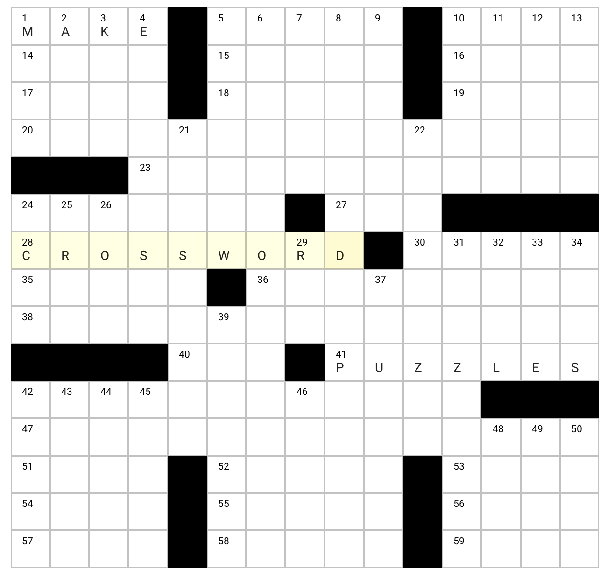

An app for authoring crossword puzzles. Optimized for [submitting to New York Times](https://www.nytimes.com/article/submit-crossword-puzzles-the-new-york-times.html).

To make a black square, set the character to '#'.

Once you've filled the grid, click Generate Clue List and then add clues for each word.

Supports saving and opening files (.txt).

The app includes a back end written in Go and a front end written in VueJS.

Run build.sh, run the executable, then go to localhost:3000/crossworder/dist in your browser.
